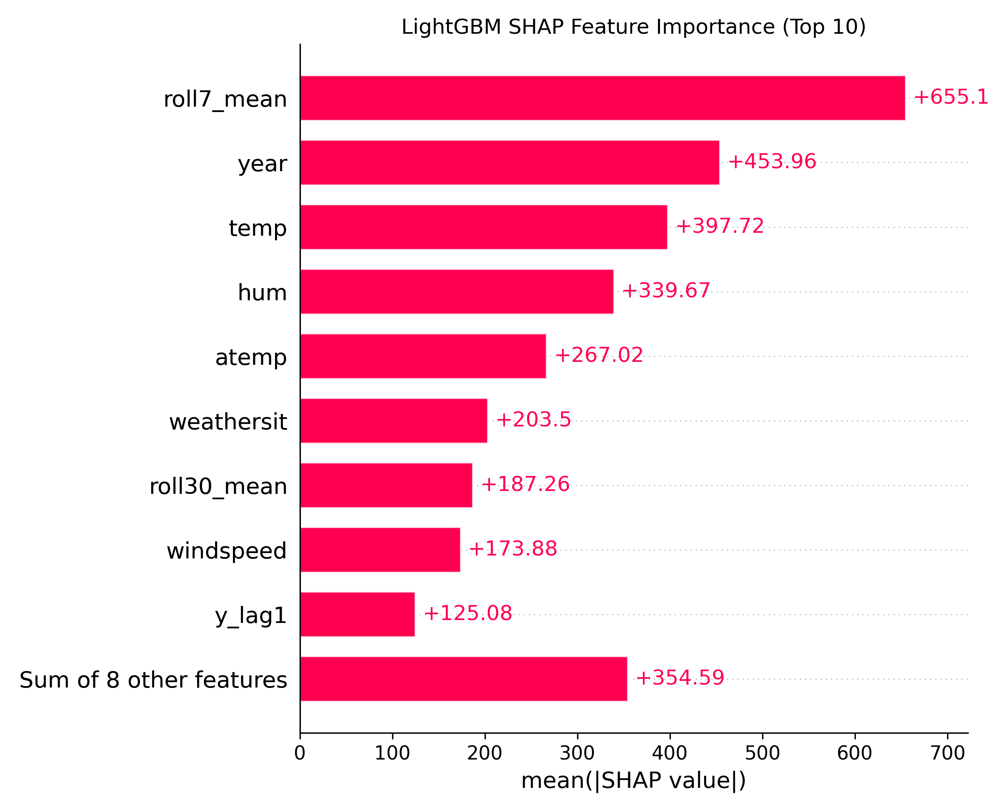
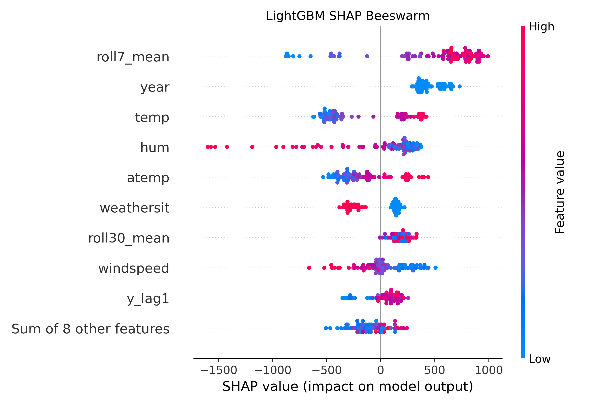

# 🚲 CycleDemand: Bike Sharing Demand Forecasting

## 📌 Objective
The goal of this project is to forecast daily bike rental demand based on historical usage patterns and weather conditions.  
Accurate forecasts support operational planning (e.g., bike availability, staffing).

---

## 📂 Dataset
- **Source**: UCI Bike Sharing Dataset (2011–2012)  
- **Granularity**: Daily rentals (`y`)  
- **Features**:
  - Calendar: year, month, day-of-week, holiday, working day, season  
  - Weather: temperature, humidity, windspeed  
  - Lagged demand: `y_lag1`, `y_lag7`, rolling averages  

---

## 🔍 Methodology
1. **Exploratory Data Analysis (EDA)**  
   - Visualized seasonal trends, weekday vs weekend, and weather impacts.  

2. **Baselines**  
   - Naïve (yesterday’s rentals)  
   - Seasonal naïve (7-day lag)  

3. **Machine Learning Models**  
   - LightGBM  
   - XGBoost  

4. **Evaluation Metrics**  
   - MAE (Mean Absolute Error)  
   - RMSE (Root Mean Squared Error)  
   - WAPE (Weighted Absolute Percentage Error)  

---

## 📊 Results

### Metrics Comparison
| Model                       | MAE   | RMSE   | WAPE   |
|------------------------------|-------|--------|--------|
| Naive (y_t-1) [VALID]        | 728.4 | 1032.9 | 0.1053 |
| Seasonal Naive (y_t-7) [VALID] | 802.0 | 1115.2 | 0.1159 |
| Naive (y_t-1) [TEST]         | 951.7 | 1380.2 | 0.1843 |
| Seasonal Naive (y_t-7) [TEST] | 1457.6| 2047.2 | 0.2822 |
| **LightGBM [VALID]**         | **621.9** | **780.4** | **0.0899** |
| **LightGBM [TEST]**          | **915.8** | **1145.8** | **0.1773** |
| XGBoost [VALID]              | 792.3 | 930.9  | 0.1145 |
| XGBoost [TEST]               | 1011.1| 1197.7 | 0.1957 |

---

### Actual vs Predicted (Test Set)

---

## 🧾 Explainability

### SHAP Feature Importances

### SHAP Beeswarm

*(Repeat for XGBoost if available)*  

---

## 💡 Key Insights
- **Lag features dominate**: `y_lag1`, `y_lag7`, and rolling averages are the strongest predictors.  
- **Weather effects matter**: rentals rise with mild temperatures, drop with high humidity and extreme cold.  
- **Seasonality is clear**: demand peaks in summer, weekends differ from weekdays.  
- **Model comparison**:  
  - LightGBM: best performance (RMSE ~1146, MAE ~916 on test).  
  - XGBoost: competitive but slightly worse (RMSE ~1198, MAE ~1011).  
  - Both beat naïve baselines by a wide margin.  
- **Explainability**: SHAP confirmed historical demand and weather as top drivers of predictions.  

---

## ✅ Conclusion
- The project achieved **forecast accuracy of ~900 rentals/day MAE**.  
- LightGBM provided the best balance of accuracy and interpretability.  
- The pipeline demonstrates **EDA → baselines → models → explainability** in a reproducible workflow.  
- This level of forecasting can **support fleet allocation, staffing, and planning** for bike sharing services.  

---

## 🚀 Next Steps
- 🔧 Tune hyperparameters for further improvement.  
- ⏰ Explore **hourly demand forecasting**.  
- 🌐 Package the model into a **deployable API or streaming service**.  
